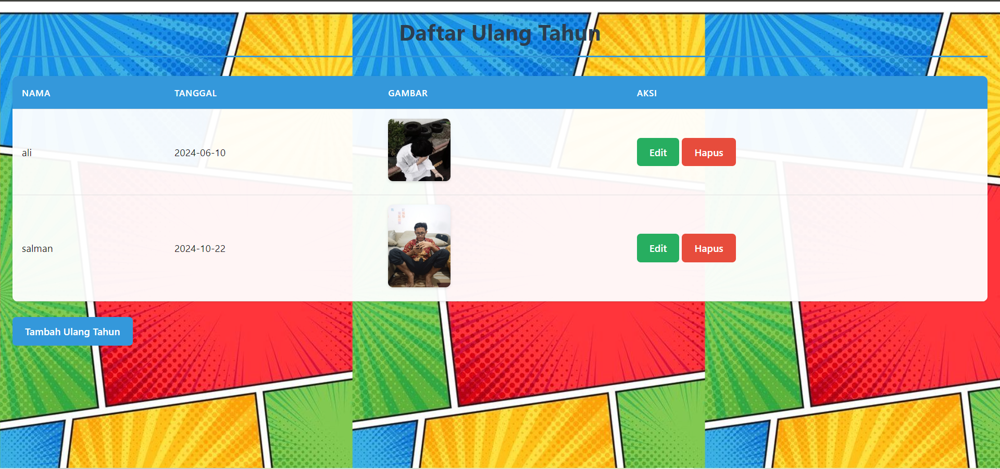

 # Aplikasi Ulang Tahun #

 ## Aplikasi Ulang Tahun adalah aplikasi sederhana yang memungkinkan pengguna untuk mengelola data ulang tahun teman dan keluarga. Pengguna dapat menambahkan, mengedit, dan menghapus informasi ulang tahun yang mencakup nama, tanggal ulang tahun, dan gambar. ##

 ### fitur ###

 - Menambahkan Ulang Tahun: Pengguna dapat menambahkan ulang tahun baru dengan memasukkan nama, tanggal, dan gambar.

- Mengedit Ulang Tahun: Pengguna dapat mengedit informasi ulang tahun yang sudah ada, termasuk nama dan tanggal.

- Menghapus Ulang Tahun: Pengguna dapat menghapus data ulang tahun yang tidak diperlukan.

- Menampilkan Ulang Tahun: Aplikasi menampilkan daftar semua ulang tahun yang telah ditambahkan.

